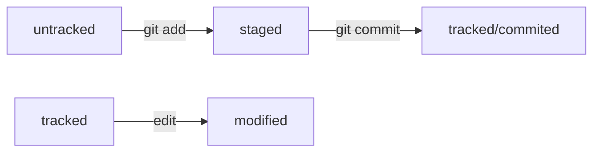

# Шпаргалка по гиту
## Основные команды
1. Склонировать проект
```bash
$ git clone <ref>
```
2. Добавить изменения
```bash
$ git add <fileName>
```
3. Выполнить коммит
```bash
$ git commit -m "description"
```
4. Запушить изменения
```bash
$ git push -u <localBranchName> <remoteBranchName>
```
5. Привязать локальный репозиторий к удаленному:
```bash
$ git remote add <localBranchName> <repoName>
```
## Дополнительные команды
* Инициализация
```bash
$ git init
```
* Посмотреть статус
```bash
$ git status
```
* Проверить подключение к удаленному репозиторию
```bash
$ git remote -v
```
* Посмотреть лог
```bash
$ git log
$ git log --oneline
```
HEAD - указатель на последний коммит 

хеш - значение, которое получается путем хеширования. Оно выполняется при выполнении коммита с помощью алгоритма SHA-1, например. При малейшем изменении файла - кардинально меняется значение хеша. Хешируются файлы и информация о коммите.



