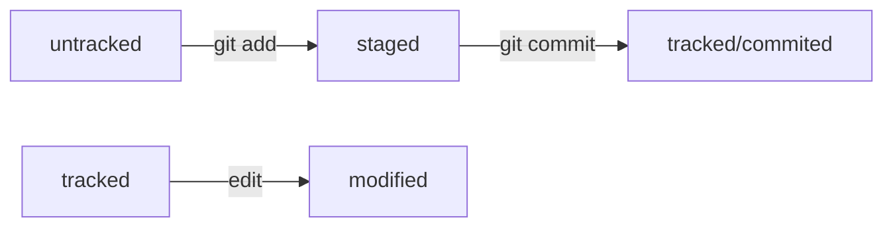

# Шпаргалка по гиту
## Основные команды
1. Склонировать проект
```bash
$ git clone <ref>
```
2. Добавить изменения
```bash
$ git add <fileName>
```
3. Выполнить коммит
```bash
$ git commit -m "description"
```
4. Запушить изменения (ключ -u для связывания локальной ветки с удаленной)
```bash
$ git push -u <localBranchName> <remoteBranchName>
```
5. Привязать локальный репозиторий к удаленному:
```bash
$ git remote add <localBranchName> <repoName>
$ git remote rm origin # эта команда удалит текущий origin
```
6. Создать ветку
```bash
$ git branch <branch_name>
```
7. Сменить текущую ветку
```bash
$ git checkout <branch_name>
```
8. Создать ветку исделать ее рабочей
```bash
$ git checkout -b <branch_name>
```
9. Посмотреть разницу между ветками (указателями на последний коммит)
```bash
$ git diff <branch1> <branch2>  #"как получить branch2 из branch1"
$ git diff <branch1>~ <branch2> # ~N - указатель на коммит текущий - N, указатель на предыдущий коммит ~
                                # можно использовать HEAD или хеши коммитов 
```
10. Слияние веток
```bash
$ git merge <branch_name> #изменяет текущую ветку и делает слияние с указанной в команде
```
11. Удаление ветки
```bash
$ git branch -D <branch_name> 
$ git branch -d <branch_name> #безопасное удаление ветки (если века была объединена с другой)
```
## Дополнительные команды
* Инициализация
```bash
$ git init
```
* Посмотреть статус
```bash
$ git status
```
* Проверить подключение к удаленному репозиторию
```bash
$ git remote -v
```
* Посмотреть лог
```bash
$ git log
$ git log --oneline
```
HEAD - указатель на последний коммит 

хеш - значение, которое получается путем хеширования. Оно выполняется при выполнении коммита с помощью алгоритма SHA-1, например. При малейшем изменении файла - кардинально меняется значение хеша. Хешируются файлы и информация о коммите (автор, дата).


```mermaid
%% статусы файлов:
graph LR
    untracked -- "git add" --> staged
    staged -- "git commit" --> tracked/commited
    tracked -- edit --> modified
```

* Добавить файлы к последнему коммиту
```bash
$ git commit --amend --no-edit
```
* Изменить название коммита 
```bash
$ git commit --amend -m <New message>
```
* Откатить staging файла (команду git add)
```bash
$ git restore --staged <file>
```
* Откатить коммит 
```bash
$ git reset --hard <commit hash>
```
* Откатить изменения в файле (не staging)
```bash
$ git restore <file>
```
* Посмотреть отличия коммитов
```bash
git diff <предыдущий коммит> <текущий коммит>
```

* Кейс 1: я делал изменения в коде в пятницу и не запушил, коллега на выходных запушил свои изменения, после выходных я решил запушить, но столкнулся с тем, что моя версия устарела, вот что делать:
```bash
$ git checkout main # перешли в main
$ git pull # подтянули новые изменения в main
$ git checkout my-branch # вернулись в рабочую ветку my-branch
$ git merge main # влили main в новую ветку my-branch
$ git push -u origin my-branch # отправили ветку my-branch в удалённый репозиторий
```
